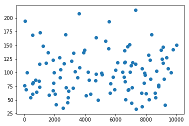

### Questions
* importing from a .py file into the notebook or anywhere else
* explain the purpose of an ide and jupyter
* set it up so it runs from one to the other (workflow)


### Objectives
YWBAT (You will be able to)
* explain when to use inheritance in OOP structured programming
* create child classes that inherit the attributes of a parent class
* build a child class that is specific to a use case

### What did we learn?
* if __name__ = main allows you to test code in vscode
* Learned that using the Parent attribute in the Child class instantiates everything in the Parent class for the child class
* better idea of what vars does
* I learned about imports so I don’t have to constantly update my kernal
* I learned that it’s better not to restart the kernel all the time
* 

### Scenario
Now that we are able to build a class to better query our database let's extend it using child classes.  The reason for this is that each table has different inputs and structures that must be taken into consideration. We want to build classes that are specific to each table.


```python
from importlib import reload

import sqlite3

import sql_connector as sc # alias the custom .py file i made
import pandas as pd
import numpy as np


import matplotlib.pyplot as plt
reload(sc) # this is reloading the custom file
```


    <module 'sql_connector' from '/Users/rafael/flatiron_dsc/curriculum/section07/mod1-section07-oop01-lesson/sql_connector.py'>


```python
conn = sc.SQLConnector(filename="data.sqlite")
```


```python
conn.tables
```


    ['orderdetails',
     'payments',
     'offices',
     'customers',
     'orders',
     'productlines',
     'products',
     'employees']


```python
products = sc.ProductsConn("data.sqlite")
```


```python
products.get_quantity_of_product(product_code="S24_1937")
```


    7332


```python
products.plot_histogram("MSRP", bins=30), products.plot_histogram("quantityInStock")
```


    (<matplotlib.figure.Figure at 0x10ba21710>,
     <matplotlib.figure.Figure at 0x10ad660b8>)


```python
df_products = products.load_products_dataframe()
```


```python
products.sort_table(df_products, 'MSRP')
```


<div>
<style scoped>
    .dataframe tbody tr th:only-of-type {
        vertical-align: middle;
    }

    .dataframe tbody tr th {
        vertical-align: top;
    }

    .dataframe thead th {
        text-align: right;
    }
</style>
<table border="1" class="dataframe">
  <thead>
    <tr style="text-align: right;">
      <th></th>
      <th>productCode</th>
      <th>productName</th>
      <th>productLine</th>
      <th>productScale</th>
      <th>productVendor</th>
      <th>productDescription</th>
      <th>quantityInStock</th>
      <th>buyPrice</th>
      <th>MSRP</th>
    </tr>
  </thead>
  <tbody>
    <tr>
      <th>60</th>
      <td>S24_1937</td>
      <td>1939 Chevrolet Deluxe Coupe</td>
      <td>Vintage Cars</td>
      <td>1:24</td>
      <td>Motor City Art Classics</td>
      <td>This 1:24 scale die-cast replica of the 1939 C...</td>
      <td>7332</td>
      <td>22.57</td>
      <td>33.19</td>
    </tr>
    <tr>
      <th>67</th>
      <td>S24_2840</td>
      <td>1958 Chevy Corvette Limited Edition</td>
      <td>Classic Cars</td>
      <td>1:24</td>
      <td>Carousel DieCast Legends</td>
      <td>The operating parts of this 1958 Chevy Corvett...</td>
      <td>2542</td>
      <td>15.91</td>
      <td>35.36</td>
    </tr>
    <tr>
      <th>70</th>
      <td>S24_2972</td>
      <td>1982 Lamborghini Diablo</td>
      <td>Classic Cars</td>
      <td>1:24</td>
      <td>Second Gear Diecast</td>
      <td>This replica features opening doors, superb de...</td>
      <td>7723</td>
      <td>16.24</td>
      <td>37.76</td>
    </tr>
    <tr>
      <th>86</th>
      <td>S32_2206</td>
      <td>1982 Ducati 996 R</td>
      <td>Motorcycles</td>
      <td>1:32</td>
      <td>Gearbox Collectibles</td>
      <td>Features rotating wheels , working kick stand....</td>
      <td>9241</td>
      <td>24.14</td>
      <td>40.23</td>
    </tr>
    <tr>
      <th>79</th>
      <td>S24_3969</td>
      <td>1936 Mercedes Benz 500k Roadster</td>
      <td>Vintage Cars</td>
      <td>1:24</td>
      <td>Red Start Diecast</td>
      <td>This model features grille-mounted chrome horn...</td>
      <td>2081</td>
      <td>21.75</td>
      <td>41.03</td>
    </tr>
    <tr>
      <th>92</th>
      <td>S50_1341</td>
      <td>1930 Buick Marquette Phaeton</td>
      <td>Vintage Cars</td>
      <td>1:50</td>
      <td>Studio M Art Models</td>
      <td>Features opening trunk,  working steering system</td>
      <td>7062</td>
      <td>27.06</td>
      <td>43.64</td>
    </tr>
    <tr>
      <th>63</th>
      <td>S24_2022</td>
      <td>1938 Cadillac V-16 Presidential Limousine</td>
      <td>Vintage Cars</td>
      <td>1:24</td>
      <td>Classic Metal Creations</td>
      <td>This 1:24 scale precision die cast replica of ...</td>
      <td>2847</td>
      <td>20.61</td>
      <td>44.80</td>
    </tr>
    <tr>
      <th>108</th>
      <td>S72_1253</td>
      <td>Boeing X-32A JSF</td>
      <td>Planes</td>
      <td>1:72</td>
      <td>Motor City Art Classics</td>
      <td>10" Wingspan with retractable landing gears.Co...</td>
      <td>4857</td>
      <td>32.77</td>
      <td>49.66</td>
    </tr>
    <tr>
      <th>52</th>
      <td>S18_4668</td>
      <td>1939 Cadillac Limousine</td>
      <td>Vintage Cars</td>
      <td>1:18</td>
      <td>Studio M Art Models</td>
      <td>Features completely detailed interior includin...</td>
      <td>6645</td>
      <td>23.14</td>
      <td>50.31</td>
    </tr>
    <tr>
      <th>58</th>
      <td>S24_1628</td>
      <td>1966 Shelby Cobra 427 S/C</td>
      <td>Classic Cars</td>
      <td>1:24</td>
      <td>Carousel DieCast Legends</td>
      <td>This diecast model of the 1966 Shelby Cobra 42...</td>
      <td>8197</td>
      <td>29.18</td>
      <td>50.31</td>
    </tr>
    <tr>
      <th>19</th>
      <td>S18_1367</td>
      <td>1936 Mercedes-Benz 500K Special Roadster</td>
      <td>Vintage Cars</td>
      <td>1:18</td>
      <td>Studio M Art Models</td>
      <td>This 1:18 scale replica is constructed of heav...</td>
      <td>8635</td>
      <td>24.26</td>
      <td>53.91</td>
    </tr>
    <tr>
      <th>87</th>
      <td>S32_2509</td>
      <td>1954 Greyhound Scenicruiser</td>
      <td>Trucks and Buses</td>
      <td>1:32</td>
      <td>Classic Metal Creations</td>
      <td>Model features bi-level seating, 50 windows, s...</td>
      <td>2874</td>
      <td>25.98</td>
      <td>54.11</td>
    </tr>
    <tr>
      <th>109</th>
      <td>S72_3212</td>
      <td>Pont Yacht</td>
      <td>Ships</td>
      <td>1:72</td>
      <td>Unimax Art Galleries</td>
      <td>Measures 38 inches Long x 33 3/4 inches High. ...</td>
      <td>414</td>
      <td>33.30</td>
      <td>54.60</td>
    </tr>
    <tr>
      <th>56</th>
      <td>S24_1444</td>
      <td>1970 Dodge Coronet</td>
      <td>Classic Cars</td>
      <td>1:24</td>
      <td>Highway 66 Mini Classics</td>
      <td>1:24 scale die-cast about 18" long doors open,...</td>
      <td>4074</td>
      <td>32.37</td>
      <td>57.80</td>
    </tr>
    <tr>
      <th>94</th>
      <td>S50_1514</td>
      <td>1962 City of Detroit Streetcar</td>
      <td>Trains</td>
      <td>1:50</td>
      <td>Classic Metal Creations</td>
      <td>This streetcar is a joy to see. It has 99 sepa...</td>
      <td>1645</td>
      <td>37.49</td>
      <td>58.58</td>
    </tr>
    <tr>
      <th>26</th>
      <td>S18_2248</td>
      <td>1911 Ford Town Car</td>
      <td>Vintage Cars</td>
      <td>1:18</td>
      <td>Motor City Art Classics</td>
      <td>Features opening hood, opening doors, opening ...</td>
      <td>540</td>
      <td>33.30</td>
      <td>60.54</td>
    </tr>
    <tr>
      <th>31</th>
      <td>S18_2625</td>
      <td>1936 Harley Davidson El Knucklehead</td>
      <td>Motorcycles</td>
      <td>1:18</td>
      <td>Welly Diecast Productions</td>
      <td>Intricately detailed with chrome accents and t...</td>
      <td>4357</td>
      <td>24.23</td>
      <td>60.57</td>
    </tr>
    <tr>
      <th>29</th>
      <td>S18_2432</td>
      <td>1926 Ford Fire Engine</td>
      <td>Trucks and Buses</td>
      <td>1:18</td>
      <td>Carousel DieCast Legends</td>
      <td>Gleaming red handsome appearance. Everything i...</td>
      <td>2018</td>
      <td>24.92</td>
      <td>60.77</td>
    </tr>
    <tr>
      <th>73</th>
      <td>S24_3371</td>
      <td>1971 Alpine Renault 1600s</td>
      <td>Classic Cars</td>
      <td>1:24</td>
      <td>Welly Diecast Productions</td>
      <td>This 1971 Alpine Renault 1600s replica Feature...</td>
      <td>7995</td>
      <td>38.58</td>
      <td>61.23</td>
    </tr>
    <tr>
      <th>88</th>
      <td>S32_3207</td>
      <td>1950's Chicago Surface Lines Streetcar</td>
      <td>Trains</td>
      <td>1:32</td>
      <td>Gearbox Collectibles</td>
      <td>This streetcar is a joy to see. It has 80 sepa...</td>
      <td>8601</td>
      <td>26.72</td>
      <td>62.14</td>
    </tr>
    <tr>
      <th>46</th>
      <td>S18_3782</td>
      <td>1957 Vespa GS150</td>
      <td>Motorcycles</td>
      <td>1:18</td>
      <td>Studio M Art Models</td>
      <td>Features rotating wheels , working kick stand....</td>
      <td>7689</td>
      <td>32.95</td>
      <td>62.17</td>
    </tr>
    <tr>
      <th>35</th>
      <td>S18_2957</td>
      <td>1934 Ford V8 Coupe</td>
      <td>Vintage Cars</td>
      <td>1:18</td>
      <td>Min Lin Diecast</td>
      <td>Chrome Trim, Chrome Grille, Opening Hood, Open...</td>
      <td>5649</td>
      <td>34.35</td>
      <td>62.46</td>
    </tr>
    <tr>
      <th>89</th>
      <td>S32_3522</td>
      <td>1996 Peterbilt 379 Stake Bed with Outrigger</td>
      <td>Trucks and Buses</td>
      <td>1:32</td>
      <td>Red Start Diecast</td>
      <td>This model features, opening doors, detailed e...</td>
      <td>814</td>
      <td>33.61</td>
      <td>64.64</td>
    </tr>
    <tr>
      <th>74</th>
      <td>S24_3420</td>
      <td>1937 Horch 930V Limousine</td>
      <td>Vintage Cars</td>
      <td>1:24</td>
      <td>Autoart Studio Design</td>
      <td>Features opening hood, opening doors, opening ...</td>
      <td>2902</td>
      <td>26.30</td>
      <td>65.75</td>
    </tr>
    <tr>
      <th>96</th>
      <td>S700_1138</td>
      <td>The Schooner Bluenose</td>
      <td>Ships</td>
      <td>1:700</td>
      <td>Autoart Studio Design</td>
      <td>All wood with canvas sails. Measures 31 1/2 in...</td>
      <td>1897</td>
      <td>34.00</td>
      <td>66.67</td>
    </tr>
    <tr>
      <th>78</th>
      <td>S24_3949</td>
      <td>Corsair F4U ( Bird Cage)</td>
      <td>Planes</td>
      <td>1:24</td>
      <td>Second Gear Diecast</td>
      <td>Has retractable wheels and comes with a stand....</td>
      <td>6812</td>
      <td>29.34</td>
      <td>68.24</td>
    </tr>
    <tr>
      <th>68</th>
      <td>S24_2841</td>
      <td>1900s Vintage Bi-Plane</td>
      <td>Planes</td>
      <td>1:24</td>
      <td>Autoart Studio Design</td>
      <td>Hand crafted diecast-like metal bi-plane is re...</td>
      <td>5942</td>
      <td>34.25</td>
      <td>68.51</td>
    </tr>
    <tr>
      <th>90</th>
      <td>S32_4289</td>
      <td>1928 Ford Phaeton Deluxe</td>
      <td>Vintage Cars</td>
      <td>1:32</td>
      <td>Highway 66 Mini Classics</td>
      <td>This model features grille-mounted chrome horn...</td>
      <td>136</td>
      <td>33.02</td>
      <td>68.79</td>
    </tr>
    <tr>
      <th>65</th>
      <td>S24_2360</td>
      <td>1982 Ducati 900 Monster</td>
      <td>Motorcycles</td>
      <td>1:24</td>
      <td>Highway 66 Mini Classics</td>
      <td>Features two-tone paint with chrome accents, s...</td>
      <td>6840</td>
      <td>47.10</td>
      <td>69.26</td>
    </tr>
    <tr>
      <th>54</th>
      <td>S18_4933</td>
      <td>1957 Ford Thunderbird</td>
      <td>Classic Cars</td>
      <td>1:18</td>
      <td>Studio M Art Models</td>
      <td>This 1:18 scale precision die-cast replica, wi...</td>
      <td>3209</td>
      <td>34.21</td>
      <td>71.27</td>
    </tr>
    <tr>
      <th>...</th>
      <td>...</td>
      <td>...</td>
      <td>...</td>
      <td>...</td>
      <td>...</td>
      <td>...</td>
      <td>...</td>
      <td>...</td>
      <td>...</td>
    </tr>
    <tr>
      <th>51</th>
      <td>S18_4600</td>
      <td>1940s Ford truck</td>
      <td>Trucks and Buses</td>
      <td>1:18</td>
      <td>Motor City Art Classics</td>
      <td>This 1940s Ford Pick-Up truck is re-created in...</td>
      <td>3128</td>
      <td>84.76</td>
      <td>121.08</td>
    </tr>
    <tr>
      <th>27</th>
      <td>S18_2319</td>
      <td>1964 Mercedes Tour Bus</td>
      <td>Trucks and Buses</td>
      <td>1:18</td>
      <td>Unimax Art Galleries</td>
      <td>Exact replica. 100+ parts. working steering sy...</td>
      <td>8258</td>
      <td>74.86</td>
      <td>122.73</td>
    </tr>
    <tr>
      <th>62</th>
      <td>S24_2011</td>
      <td>18th century schooner</td>
      <td>Ships</td>
      <td>1:24</td>
      <td>Carousel DieCast Legends</td>
      <td>All wood with canvas sails. Many extras includ...</td>
      <td>1898</td>
      <td>82.34</td>
      <td>122.89</td>
    </tr>
    <tr>
      <th>20</th>
      <td>S18_1589</td>
      <td>1965 Aston Martin DB5</td>
      <td>Classic Cars</td>
      <td>1:18</td>
      <td>Classic Metal Creations</td>
      <td>Die-cast model of the silver 1965 Aston Martin...</td>
      <td>9042</td>
      <td>65.96</td>
      <td>124.44</td>
    </tr>
    <tr>
      <th>28</th>
      <td>S18_2325</td>
      <td>1932 Model A Ford J-Coupe</td>
      <td>Vintage Cars</td>
      <td>1:18</td>
      <td>Autoart Studio Design</td>
      <td>This model features grille-mounted chrome horn...</td>
      <td>9354</td>
      <td>58.48</td>
      <td>127.13</td>
    </tr>
    <tr>
      <th>64</th>
      <td>S24_2300</td>
      <td>1962 Volkswagen Microbus</td>
      <td>Trucks and Buses</td>
      <td>1:24</td>
      <td>Autoart Studio Design</td>
      <td>This 1:18 scale die cast replica of the 1962 M...</td>
      <td>2327</td>
      <td>61.34</td>
      <td>127.79</td>
    </tr>
    <tr>
      <th>33</th>
      <td>S18_2870</td>
      <td>1999 Indy 500 Monte Carlo SS</td>
      <td>Classic Cars</td>
      <td>1:18</td>
      <td>Red Start Diecast</td>
      <td>Features include opening and closing doors. Co...</td>
      <td>8164</td>
      <td>56.76</td>
      <td>132.00</td>
    </tr>
    <tr>
      <th>4</th>
      <td>S10_4757</td>
      <td>1972 Alfa Romeo GTA</td>
      <td>Classic Cars</td>
      <td>1:10</td>
      <td>Motor City Art Classics</td>
      <td>Features include: Turnable front wheels; steer...</td>
      <td>3252</td>
      <td>85.68</td>
      <td>136.00</td>
    </tr>
    <tr>
      <th>38</th>
      <td>S18_3140</td>
      <td>1903 Ford Model A</td>
      <td>Vintage Cars</td>
      <td>1:18</td>
      <td>Unimax Art Galleries</td>
      <td>Features opening trunk,  working steering system</td>
      <td>3913</td>
      <td>68.30</td>
      <td>136.59</td>
    </tr>
    <tr>
      <th>8</th>
      <td>S12_1666</td>
      <td>1958 Setra Bus</td>
      <td>Trucks and Buses</td>
      <td>1:12</td>
      <td>Welly Diecast Productions</td>
      <td>Model features 30 windows, skylights &amp; glare r...</td>
      <td>1579</td>
      <td>77.90</td>
      <td>136.67</td>
    </tr>
    <tr>
      <th>77</th>
      <td>S24_3856</td>
      <td>1956 Porsche 356A Coupe</td>
      <td>Classic Cars</td>
      <td>1:18</td>
      <td>Classic Metal Creations</td>
      <td>Features include: Turnable front wheels; steer...</td>
      <td>6600</td>
      <td>98.30</td>
      <td>140.43</td>
    </tr>
    <tr>
      <th>45</th>
      <td>S18_3685</td>
      <td>1948 Porsche Type 356 Roadster</td>
      <td>Classic Cars</td>
      <td>1:18</td>
      <td>Gearbox Collectibles</td>
      <td>This model features working front and rear sus...</td>
      <td>8990</td>
      <td>62.16</td>
      <td>141.28</td>
    </tr>
    <tr>
      <th>17</th>
      <td>S18_1129</td>
      <td>1993 Mazda RX-7</td>
      <td>Classic Cars</td>
      <td>1:18</td>
      <td>Highway 66 Mini Classics</td>
      <td>This model features, opening hood, opening doo...</td>
      <td>3975</td>
      <td>83.51</td>
      <td>141.54</td>
    </tr>
    <tr>
      <th>24</th>
      <td>S18_1984</td>
      <td>1995 Honda Civic</td>
      <td>Classic Cars</td>
      <td>1:18</td>
      <td>Min Lin Diecast</td>
      <td>This model features, opening hood, opening doo...</td>
      <td>9772</td>
      <td>93.89</td>
      <td>142.25</td>
    </tr>
    <tr>
      <th>48</th>
      <td>S18_4027</td>
      <td>1970 Triumph Spitfire</td>
      <td>Classic Cars</td>
      <td>1:18</td>
      <td>Min Lin Diecast</td>
      <td>Features include opening and closing doors. Co...</td>
      <td>5545</td>
      <td>91.92</td>
      <td>143.62</td>
    </tr>
    <tr>
      <th>44</th>
      <td>S18_3482</td>
      <td>1976 Ford Gran Torino</td>
      <td>Classic Cars</td>
      <td>1:18</td>
      <td>Gearbox Collectibles</td>
      <td>Highly detailed 1976 Ford Gran Torino "Starsky...</td>
      <td>9127</td>
      <td>73.49</td>
      <td>146.99</td>
    </tr>
    <tr>
      <th>5</th>
      <td>S10_4962</td>
      <td>1962 LanciaA Delta 16V</td>
      <td>Classic Cars</td>
      <td>1:10</td>
      <td>Second Gear Diecast</td>
      <td>Features include: Turnable front wheels; steer...</td>
      <td>6791</td>
      <td>103.42</td>
      <td>147.74</td>
    </tr>
    <tr>
      <th>53</th>
      <td>S18_4721</td>
      <td>1957 Corvette Convertible</td>
      <td>Classic Cars</td>
      <td>1:18</td>
      <td>Classic Metal Creations</td>
      <td>1957 die cast Corvette Convertible in Roman Re...</td>
      <td>1249</td>
      <td>69.93</td>
      <td>148.80</td>
    </tr>
    <tr>
      <th>9</th>
      <td>S12_2823</td>
      <td>2002 Suzuki XREO</td>
      <td>Motorcycles</td>
      <td>1:12</td>
      <td>Unimax Art Galleries</td>
      <td>Official logos and insignias, saddle bags loca...</td>
      <td>9997</td>
      <td>66.27</td>
      <td>150.62</td>
    </tr>
    <tr>
      <th>10</th>
      <td>S12_3148</td>
      <td>1969 Corvair Monza</td>
      <td>Classic Cars</td>
      <td>1:18</td>
      <td>Welly Diecast Productions</td>
      <td>1:18 scale die-cast about 10" long doors open,...</td>
      <td>6906</td>
      <td>89.14</td>
      <td>151.08</td>
    </tr>
    <tr>
      <th>21</th>
      <td>S18_1662</td>
      <td>1980s Black Hawk Helicopter</td>
      <td>Planes</td>
      <td>1:18</td>
      <td>Red Start Diecast</td>
      <td>1:18 scale replica of actual Army's UH-60L BLA...</td>
      <td>5330</td>
      <td>77.27</td>
      <td>157.69</td>
    </tr>
    <tr>
      <th>25</th>
      <td>S18_2238</td>
      <td>1998 Chrysler Plymouth Prowler</td>
      <td>Classic Cars</td>
      <td>1:18</td>
      <td>Gearbox Collectibles</td>
      <td>Turnable front wheels; steering function; deta...</td>
      <td>4724</td>
      <td>101.51</td>
      <td>163.73</td>
    </tr>
    <tr>
      <th>32</th>
      <td>S18_2795</td>
      <td>1928 Mercedes-Benz SSK</td>
      <td>Vintage Cars</td>
      <td>1:18</td>
      <td>Gearbox Collectibles</td>
      <td>This 1:18 replica features grille-mounted chro...</td>
      <td>548</td>
      <td>72.56</td>
      <td>168.75</td>
    </tr>
    <tr>
      <th>39</th>
      <td>S18_3232</td>
      <td>1992 Ferrari 360 Spider red</td>
      <td>Classic Cars</td>
      <td>1:18</td>
      <td>Unimax Art Galleries</td>
      <td>his replica features opening doors, superb det...</td>
      <td>8347</td>
      <td>77.90</td>
      <td>169.34</td>
    </tr>
    <tr>
      <th>22</th>
      <td>S18_1749</td>
      <td>1917 Grand Touring Sedan</td>
      <td>Vintage Cars</td>
      <td>1:18</td>
      <td>Welly Diecast Productions</td>
      <td>This 1:18 scale replica of the 1917 Grand Tour...</td>
      <td>2724</td>
      <td>86.70</td>
      <td>170.00</td>
    </tr>
    <tr>
      <th>12</th>
      <td>S12_3891</td>
      <td>1969 Ford Falcon</td>
      <td>Classic Cars</td>
      <td>1:12</td>
      <td>Second Gear Diecast</td>
      <td>Turnable front wheels; steering function; deta...</td>
      <td>1049</td>
      <td>83.05</td>
      <td>173.02</td>
    </tr>
    <tr>
      <th>3</th>
      <td>S10_4698</td>
      <td>2003 Harley-Davidson Eagle Drag Bike</td>
      <td>Motorcycles</td>
      <td>1:10</td>
      <td>Red Start Diecast</td>
      <td>Model features, official Harley Davidson logos...</td>
      <td>5582</td>
      <td>91.02</td>
      <td>193.66</td>
    </tr>
    <tr>
      <th>6</th>
      <td>S12_1099</td>
      <td>1968 Ford Mustang</td>
      <td>Classic Cars</td>
      <td>1:12</td>
      <td>Autoart Studio Design</td>
      <td>Hood, doors and trunk all open to reveal highl...</td>
      <td>68</td>
      <td>95.34</td>
      <td>194.57</td>
    </tr>
    <tr>
      <th>7</th>
      <td>S12_1108</td>
      <td>2001 Ferrari Enzo</td>
      <td>Classic Cars</td>
      <td>1:12</td>
      <td>Second Gear Diecast</td>
      <td>Turnable front wheels; steering function; deta...</td>
      <td>3619</td>
      <td>95.59</td>
      <td>207.80</td>
    </tr>
    <tr>
      <th>1</th>
      <td>S10_1949</td>
      <td>1952 Alpine Renault 1300</td>
      <td>Classic Cars</td>
      <td>1:10</td>
      <td>Classic Metal Creations</td>
      <td>Turnable front wheels; steering function; deta...</td>
      <td>7305</td>
      <td>98.58</td>
      <td>214.30</td>
    </tr>
  </tbody>
</table>
<p>110 rows × 9 columns</p>
</div>


```python
plt.scatter(df_products.quantityInStock, df_products.MSRP)
```


    <matplotlib.collections.PathCollection at 0x1160a85f8>





```python
# experimenting with methods to clean our dataframe to later put in our child class
df_products["quantityInStock"] = df_products.quantityInStock.astype(int)
df_products["MSRP"] = df_products.MSRP.astype(float)
df_products["buyPrice"] = df_products.buyPrice.astype(float)

df_products.info()
```

    <class 'pandas.core.frame.DataFrame'>
    RangeIndex: 110 entries, 0 to 109
    Data columns (total 9 columns):
    productCode           110 non-null object
    productName           110 non-null object
    productLine           110 non-null object
    productScale          110 non-null object
    productVendor         110 non-null object
    productDescription    110 non-null object
    quantityInStock       110 non-null int64
    buyPrice              110 non-null float64
    MSRP                  110 non-null float64
    dtypes: float64(2), int64(1), object(6)
    memory usage: 7.8+ KB


```python
df_products.head()
```


<div>
<style scoped>
    .dataframe tbody tr th:only-of-type {
        vertical-align: middle;
    }

    .dataframe tbody tr th {
        vertical-align: top;
    }

    .dataframe thead th {
        text-align: right;
    }
</style>
<table border="1" class="dataframe">
  <thead>
    <tr style="text-align: right;">
      <th></th>
      <th>productCode</th>
      <th>productName</th>
      <th>productLine</th>
      <th>productScale</th>
      <th>productVendor</th>
      <th>productDescription</th>
      <th>quantityInStock</th>
      <th>buyPrice</th>
      <th>MSRP</th>
    </tr>
  </thead>
  <tbody>
    <tr>
      <th>0</th>
      <td>S10_1678</td>
      <td>1969 Harley Davidson Ultimate Chopper</td>
      <td>Motorcycles</td>
      <td>1:10</td>
      <td>Min Lin Diecast</td>
      <td>This replica features working kickstand, front...</td>
      <td>7933</td>
      <td>48.81</td>
      <td>95.70</td>
    </tr>
    <tr>
      <th>1</th>
      <td>S10_1949</td>
      <td>1952 Alpine Renault 1300</td>
      <td>Classic Cars</td>
      <td>1:10</td>
      <td>Classic Metal Creations</td>
      <td>Turnable front wheels; steering function; deta...</td>
      <td>7305</td>
      <td>98.58</td>
      <td>214.30</td>
    </tr>
    <tr>
      <th>2</th>
      <td>S10_2016</td>
      <td>1996 Moto Guzzi 1100i</td>
      <td>Motorcycles</td>
      <td>1:10</td>
      <td>Highway 66 Mini Classics</td>
      <td>Official Moto Guzzi logos and insignias, saddl...</td>
      <td>6625</td>
      <td>68.99</td>
      <td>118.94</td>
    </tr>
    <tr>
      <th>3</th>
      <td>S10_4698</td>
      <td>2003 Harley-Davidson Eagle Drag Bike</td>
      <td>Motorcycles</td>
      <td>1:10</td>
      <td>Red Start Diecast</td>
      <td>Model features, official Harley Davidson logos...</td>
      <td>5582</td>
      <td>91.02</td>
      <td>193.66</td>
    </tr>
    <tr>
      <th>4</th>
      <td>S10_4757</td>
      <td>1972 Alfa Romeo GTA</td>
      <td>Classic Cars</td>
      <td>1:10</td>
      <td>Motor City Art Classics</td>
      <td>Features include: Turnable front wheels; steer...</td>
      <td>3252</td>
      <td>85.68</td>
      <td>136.00</td>
    </tr>
  </tbody>
</table>
</div>


```python
df_products.sort_values(by='quantityInStock')
```


<div>
<style scoped>
    .dataframe tbody tr th:only-of-type {
        vertical-align: middle;
    }

    .dataframe tbody tr th {
        vertical-align: top;
    }

    .dataframe thead th {
        text-align: right;
    }
</style>
<table border="1" class="dataframe">
  <thead>
    <tr style="text-align: right;">
      <th></th>
      <th>productCode</th>
      <th>productName</th>
      <th>productLine</th>
      <th>productScale</th>
      <th>productVendor</th>
      <th>productDescription</th>
      <th>quantityInStock</th>
      <th>buyPrice</th>
      <th>MSRP</th>
    </tr>
  </thead>
  <tbody>
    <tr>
      <th>61</th>
      <td>S24_2000</td>
      <td>1960 BSA Gold Star DBD34</td>
      <td>Motorcycles</td>
      <td>1:24</td>
      <td>Highway 66 Mini Classics</td>
      <td>Detailed scale replica with working suspension...</td>
      <td>15</td>
      <td>37.32</td>
      <td>76.17</td>
    </tr>
    <tr>
      <th>6</th>
      <td>S12_1099</td>
      <td>1968 Ford Mustang</td>
      <td>Classic Cars</td>
      <td>1:12</td>
      <td>Autoart Studio Design</td>
      <td>Hood, doors and trunk all open to reveal highl...</td>
      <td>68</td>
      <td>95.34</td>
      <td>194.57</td>
    </tr>
    <tr>
      <th>90</th>
      <td>S32_4289</td>
      <td>1928 Ford Phaeton Deluxe</td>
      <td>Vintage Cars</td>
      <td>1:32</td>
      <td>Highway 66 Mini Classics</td>
      <td>This model features grille-mounted chrome horn...</td>
      <td>136</td>
      <td>33.02</td>
      <td>68.79</td>
    </tr>
    <tr>
      <th>85</th>
      <td>S32_1374</td>
      <td>1997 BMW F650 ST</td>
      <td>Motorcycles</td>
      <td>1:32</td>
      <td>Exoto Designs</td>
      <td>Features official die-struck logos and baked e...</td>
      <td>178</td>
      <td>66.92</td>
      <td>99.89</td>
    </tr>
    <tr>
      <th>109</th>
      <td>S72_3212</td>
      <td>Pont Yacht</td>
      <td>Ships</td>
      <td>1:72</td>
      <td>Unimax Art Galleries</td>
      <td>Measures 38 inches Long x 33 3/4 inches High. ...</td>
      <td>414</td>
      <td>33.30</td>
      <td>54.60</td>
    </tr>
    <tr>
      <th>26</th>
      <td>S18_2248</td>
      <td>1911 Ford Town Car</td>
      <td>Vintage Cars</td>
      <td>1:18</td>
      <td>Motor City Art Classics</td>
      <td>Features opening hood, opening doors, opening ...</td>
      <td>540</td>
      <td>33.30</td>
      <td>60.54</td>
    </tr>
    <tr>
      <th>32</th>
      <td>S18_2795</td>
      <td>1928 Mercedes-Benz SSK</td>
      <td>Vintage Cars</td>
      <td>1:18</td>
      <td>Gearbox Collectibles</td>
      <td>This 1:18 replica features grille-mounted chro...</td>
      <td>548</td>
      <td>72.56</td>
      <td>168.75</td>
    </tr>
    <tr>
      <th>104</th>
      <td>S700_3167</td>
      <td>F/A 18 Hornet 1/72</td>
      <td>Planes</td>
      <td>1:72</td>
      <td>Motor City Art Classics</td>
      <td>10" Wingspan with retractable landing gears.Co...</td>
      <td>551</td>
      <td>54.40</td>
      <td>80.00</td>
    </tr>
    <tr>
      <th>95</th>
      <td>S50_4713</td>
      <td>2002 Yamaha YZR M1</td>
      <td>Motorcycles</td>
      <td>1:50</td>
      <td>Autoart Studio Design</td>
      <td>Features rotating wheels , working kick stand....</td>
      <td>600</td>
      <td>34.17</td>
      <td>81.36</td>
    </tr>
    <tr>
      <th>98</th>
      <td>S700_1938</td>
      <td>The Mayflower</td>
      <td>Ships</td>
      <td>1:700</td>
      <td>Studio M Art Models</td>
      <td>Measures 31 1/2 inches Long x 25 1/2 inches Hi...</td>
      <td>737</td>
      <td>43.30</td>
      <td>86.61</td>
    </tr>
    <tr>
      <th>89</th>
      <td>S32_3522</td>
      <td>1996 Peterbilt 379 Stake Bed with Outrigger</td>
      <td>Trucks and Buses</td>
      <td>1:32</td>
      <td>Red Start Diecast</td>
      <td>This model features, opening doors, detailed e...</td>
      <td>814</td>
      <td>33.61</td>
      <td>64.64</td>
    </tr>
    <tr>
      <th>30</th>
      <td>S18_2581</td>
      <td>P-51-D Mustang</td>
      <td>Planes</td>
      <td>1:72</td>
      <td>Gearbox Collectibles</td>
      <td>Has retractable wheels and comes with a stand</td>
      <td>992</td>
      <td>49.00</td>
      <td>84.48</td>
    </tr>
    <tr>
      <th>55</th>
      <td>S24_1046</td>
      <td>1970 Chevy Chevelle SS 454</td>
      <td>Classic Cars</td>
      <td>1:24</td>
      <td>Unimax Art Galleries</td>
      <td>This model features rotating wheels, working s...</td>
      <td>1005</td>
      <td>49.24</td>
      <td>73.49</td>
    </tr>
    <tr>
      <th>93</th>
      <td>S50_1392</td>
      <td>Diamond T620 Semi-Skirted Tanker</td>
      <td>Trucks and Buses</td>
      <td>1:50</td>
      <td>Highway 66 Mini Classics</td>
      <td>This limited edition model is licensed and per...</td>
      <td>1016</td>
      <td>68.29</td>
      <td>115.75</td>
    </tr>
    <tr>
      <th>12</th>
      <td>S12_3891</td>
      <td>1969 Ford Falcon</td>
      <td>Classic Cars</td>
      <td>1:12</td>
      <td>Second Gear Diecast</td>
      <td>Turnable front wheels; steering function; deta...</td>
      <td>1049</td>
      <td>83.05</td>
      <td>173.02</td>
    </tr>
    <tr>
      <th>53</th>
      <td>S18_4721</td>
      <td>1957 Corvette Convertible</td>
      <td>Classic Cars</td>
      <td>1:18</td>
      <td>Classic Metal Creations</td>
      <td>1957 die cast Corvette Convertible in Roman Re...</td>
      <td>1249</td>
      <td>69.93</td>
      <td>148.80</td>
    </tr>
    <tr>
      <th>69</th>
      <td>S24_2887</td>
      <td>1952 Citroen-15CV</td>
      <td>Classic Cars</td>
      <td>1:24</td>
      <td>Exoto Designs</td>
      <td>Precision crafted hand-assembled 1:18 scale re...</td>
      <td>1452</td>
      <td>72.82</td>
      <td>117.44</td>
    </tr>
    <tr>
      <th>8</th>
      <td>S12_1666</td>
      <td>1958 Setra Bus</td>
      <td>Trucks and Buses</td>
      <td>1:12</td>
      <td>Welly Diecast Productions</td>
      <td>Model features 30 windows, skylights &amp; glare r...</td>
      <td>1579</td>
      <td>77.90</td>
      <td>136.67</td>
    </tr>
    <tr>
      <th>94</th>
      <td>S50_1514</td>
      <td>1962 City of Detroit Streetcar</td>
      <td>Trains</td>
      <td>1:50</td>
      <td>Classic Metal Creations</td>
      <td>This streetcar is a joy to see. It has 99 sepa...</td>
      <td>1645</td>
      <td>37.49</td>
      <td>58.58</td>
    </tr>
    <tr>
      <th>96</th>
      <td>S700_1138</td>
      <td>The Schooner Bluenose</td>
      <td>Ships</td>
      <td>1:700</td>
      <td>Autoart Studio Design</td>
      <td>All wood with canvas sails. Measures 31 1/2 in...</td>
      <td>1897</td>
      <td>34.00</td>
      <td>66.67</td>
    </tr>
    <tr>
      <th>62</th>
      <td>S24_2011</td>
      <td>18th century schooner</td>
      <td>Ships</td>
      <td>1:24</td>
      <td>Carousel DieCast Legends</td>
      <td>All wood with canvas sails. Many extras includ...</td>
      <td>1898</td>
      <td>82.34</td>
      <td>122.89</td>
    </tr>
    <tr>
      <th>42</th>
      <td>S18_3278</td>
      <td>1969 Dodge Super Bee</td>
      <td>Classic Cars</td>
      <td>1:18</td>
      <td>Min Lin Diecast</td>
      <td>This replica features opening doors, superb de...</td>
      <td>1917</td>
      <td>49.05</td>
      <td>80.41</td>
    </tr>
    <tr>
      <th>105</th>
      <td>S700_3505</td>
      <td>The Titanic</td>
      <td>Ships</td>
      <td>1:700</td>
      <td>Carousel DieCast Legends</td>
      <td>Completed model measures 19 1/2 inches long, 9...</td>
      <td>1956</td>
      <td>51.09</td>
      <td>100.17</td>
    </tr>
    <tr>
      <th>29</th>
      <td>S18_2432</td>
      <td>1926 Ford Fire Engine</td>
      <td>Trucks and Buses</td>
      <td>1:18</td>
      <td>Carousel DieCast Legends</td>
      <td>Gleaming red handsome appearance. Everything i...</td>
      <td>2018</td>
      <td>24.92</td>
      <td>60.77</td>
    </tr>
    <tr>
      <th>79</th>
      <td>S24_3969</td>
      <td>1936 Mercedes Benz 500k Roadster</td>
      <td>Vintage Cars</td>
      <td>1:24</td>
      <td>Red Start Diecast</td>
      <td>This model features grille-mounted chrome horn...</td>
      <td>2081</td>
      <td>21.75</td>
      <td>41.03</td>
    </tr>
    <tr>
      <th>64</th>
      <td>S24_2300</td>
      <td>1962 Volkswagen Microbus</td>
      <td>Trucks and Buses</td>
      <td>1:24</td>
      <td>Autoart Studio Design</td>
      <td>This 1:18 scale die cast replica of the 1962 M...</td>
      <td>2327</td>
      <td>61.34</td>
      <td>127.79</td>
    </tr>
    <tr>
      <th>66</th>
      <td>S24_2766</td>
      <td>1949 Jaguar XK 120</td>
      <td>Classic Cars</td>
      <td>1:24</td>
      <td>Classic Metal Creations</td>
      <td>Precision-engineered from original Jaguar spec...</td>
      <td>2350</td>
      <td>47.25</td>
      <td>90.87</td>
    </tr>
    <tr>
      <th>47</th>
      <td>S18_3856</td>
      <td>1941 Chevrolet Special Deluxe Cabriolet</td>
      <td>Vintage Cars</td>
      <td>1:18</td>
      <td>Exoto Designs</td>
      <td>Features opening hood, opening doors, opening ...</td>
      <td>2378</td>
      <td>64.58</td>
      <td>105.87</td>
    </tr>
    <tr>
      <th>67</th>
      <td>S24_2840</td>
      <td>1958 Chevy Corvette Limited Edition</td>
      <td>Classic Cars</td>
      <td>1:24</td>
      <td>Carousel DieCast Legends</td>
      <td>The operating parts of this 1958 Chevy Corvett...</td>
      <td>2542</td>
      <td>15.91</td>
      <td>35.36</td>
    </tr>
    <tr>
      <th>16</th>
      <td>S18_1097</td>
      <td>1940 Ford Pickup Truck</td>
      <td>Trucks and Buses</td>
      <td>1:18</td>
      <td>Studio M Art Models</td>
      <td>This model features soft rubber tires, working...</td>
      <td>2613</td>
      <td>58.33</td>
      <td>116.67</td>
    </tr>
    <tr>
      <th>...</th>
      <td>...</td>
      <td>...</td>
      <td>...</td>
      <td>...</td>
      <td>...</td>
      <td>...</td>
      <td>...</td>
      <td>...</td>
      <td>...</td>
    </tr>
    <tr>
      <th>15</th>
      <td>S12_4675</td>
      <td>1969 Dodge Charger</td>
      <td>Classic Cars</td>
      <td>1:12</td>
      <td>Welly Diecast Productions</td>
      <td>Detailed model of the 1969 Dodge Charger. This...</td>
      <td>7323</td>
      <td>58.73</td>
      <td>115.16</td>
    </tr>
    <tr>
      <th>60</th>
      <td>S24_1937</td>
      <td>1939 Chevrolet Deluxe Coupe</td>
      <td>Vintage Cars</td>
      <td>1:24</td>
      <td>Motor City Art Classics</td>
      <td>This 1:24 scale die-cast replica of the 1939 C...</td>
      <td>7332</td>
      <td>22.57</td>
      <td>33.19</td>
    </tr>
    <tr>
      <th>46</th>
      <td>S18_3782</td>
      <td>1957 Vespa GS150</td>
      <td>Motorcycles</td>
      <td>1:18</td>
      <td>Studio M Art Models</td>
      <td>Features rotating wheels , working kick stand....</td>
      <td>7689</td>
      <td>32.95</td>
      <td>62.17</td>
    </tr>
    <tr>
      <th>70</th>
      <td>S24_2972</td>
      <td>1982 Lamborghini Diablo</td>
      <td>Classic Cars</td>
      <td>1:24</td>
      <td>Second Gear Diecast</td>
      <td>This replica features opening doors, superb de...</td>
      <td>7723</td>
      <td>16.24</td>
      <td>37.76</td>
    </tr>
    <tr>
      <th>40</th>
      <td>S18_3233</td>
      <td>1985 Toyota Supra</td>
      <td>Classic Cars</td>
      <td>1:18</td>
      <td>Highway 66 Mini Classics</td>
      <td>This model features soft rubber tires, working...</td>
      <td>7733</td>
      <td>57.01</td>
      <td>107.57</td>
    </tr>
    <tr>
      <th>83</th>
      <td>S24_4620</td>
      <td>1961 Chevrolet Impala</td>
      <td>Classic Cars</td>
      <td>1:18</td>
      <td>Classic Metal Creations</td>
      <td>This 1:18 scale precision die-cast reproductio...</td>
      <td>7869</td>
      <td>32.33</td>
      <td>80.84</td>
    </tr>
    <tr>
      <th>43</th>
      <td>S18_3320</td>
      <td>1917 Maxwell Touring Car</td>
      <td>Vintage Cars</td>
      <td>1:18</td>
      <td>Exoto Designs</td>
      <td>Features Gold Trim, Full Size Spare Tire, Chro...</td>
      <td>7913</td>
      <td>57.54</td>
      <td>99.21</td>
    </tr>
    <tr>
      <th>0</th>
      <td>S10_1678</td>
      <td>1969 Harley Davidson Ultimate Chopper</td>
      <td>Motorcycles</td>
      <td>1:10</td>
      <td>Min Lin Diecast</td>
      <td>This replica features working kickstand, front...</td>
      <td>7933</td>
      <td>48.81</td>
      <td>95.70</td>
    </tr>
    <tr>
      <th>73</th>
      <td>S24_3371</td>
      <td>1971 Alpine Renault 1600s</td>
      <td>Classic Cars</td>
      <td>1:24</td>
      <td>Welly Diecast Productions</td>
      <td>This 1971 Alpine Renault 1600s replica Feature...</td>
      <td>7995</td>
      <td>38.58</td>
      <td>61.23</td>
    </tr>
    <tr>
      <th>33</th>
      <td>S18_2870</td>
      <td>1999 Indy 500 Monte Carlo SS</td>
      <td>Classic Cars</td>
      <td>1:18</td>
      <td>Red Start Diecast</td>
      <td>Features include opening and closing doors. Co...</td>
      <td>8164</td>
      <td>56.76</td>
      <td>132.00</td>
    </tr>
    <tr>
      <th>58</th>
      <td>S24_1628</td>
      <td>1966 Shelby Cobra 427 S/C</td>
      <td>Classic Cars</td>
      <td>1:24</td>
      <td>Carousel DieCast Legends</td>
      <td>This diecast model of the 1966 Shelby Cobra 42...</td>
      <td>8197</td>
      <td>29.18</td>
      <td>50.31</td>
    </tr>
    <tr>
      <th>27</th>
      <td>S18_2319</td>
      <td>1964 Mercedes Tour Bus</td>
      <td>Trucks and Buses</td>
      <td>1:18</td>
      <td>Unimax Art Galleries</td>
      <td>Exact replica. 100+ parts. working steering sy...</td>
      <td>8258</td>
      <td>74.86</td>
      <td>122.73</td>
    </tr>
    <tr>
      <th>50</th>
      <td>S18_4522</td>
      <td>1904 Buick Runabout</td>
      <td>Vintage Cars</td>
      <td>1:18</td>
      <td>Exoto Designs</td>
      <td>Features opening trunk,  working steering system</td>
      <td>8290</td>
      <td>52.66</td>
      <td>87.77</td>
    </tr>
    <tr>
      <th>39</th>
      <td>S18_3232</td>
      <td>1992 Ferrari 360 Spider red</td>
      <td>Classic Cars</td>
      <td>1:18</td>
      <td>Unimax Art Galleries</td>
      <td>his replica features opening doors, superb det...</td>
      <td>8347</td>
      <td>77.90</td>
      <td>169.34</td>
    </tr>
    <tr>
      <th>88</th>
      <td>S32_3207</td>
      <td>1950's Chicago Surface Lines Streetcar</td>
      <td>Trains</td>
      <td>1:32</td>
      <td>Gearbox Collectibles</td>
      <td>This streetcar is a joy to see. It has 80 sepa...</td>
      <td>8601</td>
      <td>26.72</td>
      <td>62.14</td>
    </tr>
    <tr>
      <th>19</th>
      <td>S18_1367</td>
      <td>1936 Mercedes-Benz 500K Special Roadster</td>
      <td>Vintage Cars</td>
      <td>1:18</td>
      <td>Studio M Art Models</td>
      <td>This 1:18 scale replica is constructed of heav...</td>
      <td>8635</td>
      <td>24.26</td>
      <td>53.91</td>
    </tr>
    <tr>
      <th>18</th>
      <td>S18_1342</td>
      <td>1937 Lincoln Berline</td>
      <td>Vintage Cars</td>
      <td>1:18</td>
      <td>Motor City Art Classics</td>
      <td>Features opening engine cover, doors, trunk, a...</td>
      <td>8693</td>
      <td>60.62</td>
      <td>102.74</td>
    </tr>
    <tr>
      <th>107</th>
      <td>S700_4002</td>
      <td>American Airlines: MD-11S</td>
      <td>Planes</td>
      <td>1:700</td>
      <td>Second Gear Diecast</td>
      <td>Polished finish. Exact replia with official lo...</td>
      <td>8820</td>
      <td>36.27</td>
      <td>74.03</td>
    </tr>
    <tr>
      <th>23</th>
      <td>S18_1889</td>
      <td>1948 Porsche 356-A Roadster</td>
      <td>Classic Cars</td>
      <td>1:18</td>
      <td>Gearbox Collectibles</td>
      <td>This precision die-cast replica features openi...</td>
      <td>8826</td>
      <td>53.90</td>
      <td>77.00</td>
    </tr>
    <tr>
      <th>45</th>
      <td>S18_3685</td>
      <td>1948 Porsche Type 356 Roadster</td>
      <td>Classic Cars</td>
      <td>1:18</td>
      <td>Gearbox Collectibles</td>
      <td>This model features working front and rear sus...</td>
      <td>8990</td>
      <td>62.16</td>
      <td>141.28</td>
    </tr>
    <tr>
      <th>20</th>
      <td>S18_1589</td>
      <td>1965 Aston Martin DB5</td>
      <td>Classic Cars</td>
      <td>1:18</td>
      <td>Classic Metal Creations</td>
      <td>Die-cast model of the silver 1965 Aston Martin...</td>
      <td>9042</td>
      <td>65.96</td>
      <td>124.44</td>
    </tr>
    <tr>
      <th>11</th>
      <td>S12_3380</td>
      <td>1968 Dodge Charger</td>
      <td>Classic Cars</td>
      <td>1:12</td>
      <td>Welly Diecast Productions</td>
      <td>1:12 scale model of a 1968 Dodge Charger. Hood...</td>
      <td>9123</td>
      <td>75.16</td>
      <td>117.44</td>
    </tr>
    <tr>
      <th>44</th>
      <td>S18_3482</td>
      <td>1976 Ford Gran Torino</td>
      <td>Classic Cars</td>
      <td>1:18</td>
      <td>Gearbox Collectibles</td>
      <td>Highly detailed 1976 Ford Gran Torino "Starsky...</td>
      <td>9127</td>
      <td>73.49</td>
      <td>146.99</td>
    </tr>
    <tr>
      <th>71</th>
      <td>S24_3151</td>
      <td>1912 Ford Model T Delivery Wagon</td>
      <td>Vintage Cars</td>
      <td>1:24</td>
      <td>Min Lin Diecast</td>
      <td>This model features chrome trim and grille, op...</td>
      <td>9173</td>
      <td>46.91</td>
      <td>88.51</td>
    </tr>
    <tr>
      <th>86</th>
      <td>S32_2206</td>
      <td>1982 Ducati 996 R</td>
      <td>Motorcycles</td>
      <td>1:32</td>
      <td>Gearbox Collectibles</td>
      <td>Features rotating wheels , working kick stand....</td>
      <td>9241</td>
      <td>24.14</td>
      <td>40.23</td>
    </tr>
    <tr>
      <th>28</th>
      <td>S18_2325</td>
      <td>1932 Model A Ford J-Coupe</td>
      <td>Vintage Cars</td>
      <td>1:18</td>
      <td>Autoart Studio Design</td>
      <td>This model features grille-mounted chrome horn...</td>
      <td>9354</td>
      <td>58.48</td>
      <td>127.13</td>
    </tr>
    <tr>
      <th>75</th>
      <td>S24_3432</td>
      <td>2002 Chevy Corvette</td>
      <td>Classic Cars</td>
      <td>1:24</td>
      <td>Gearbox Collectibles</td>
      <td>The operating parts of this limited edition Di...</td>
      <td>9446</td>
      <td>62.11</td>
      <td>107.08</td>
    </tr>
    <tr>
      <th>100</th>
      <td>S700_2466</td>
      <td>America West Airlines B757-200</td>
      <td>Planes</td>
      <td>1:700</td>
      <td>Motor City Art Classics</td>
      <td>Official logos and insignias. Working steering...</td>
      <td>9653</td>
      <td>68.80</td>
      <td>99.72</td>
    </tr>
    <tr>
      <th>24</th>
      <td>S18_1984</td>
      <td>1995 Honda Civic</td>
      <td>Classic Cars</td>
      <td>1:18</td>
      <td>Min Lin Diecast</td>
      <td>This model features, opening hood, opening doo...</td>
      <td>9772</td>
      <td>93.89</td>
      <td>142.25</td>
    </tr>
    <tr>
      <th>9</th>
      <td>S12_2823</td>
      <td>2002 Suzuki XREO</td>
      <td>Motorcycles</td>
      <td>1:12</td>
      <td>Unimax Art Galleries</td>
      <td>Official logos and insignias, saddle bags loca...</td>
      <td>9997</td>
      <td>66.27</td>
      <td>150.62</td>
    </tr>
  </tbody>
</table>
<p>110 rows × 9 columns</p>
</div>


```python
connection = sqlite3.Connection("data.sqlite")
cursor = connection.cursor()
```


```python
conn.tables
```


    ['orderdetails',
     'payments',
     'offices',
     'customers',
     'orders',
     'productlines',
     'products',
     'employees']


"""
select {}
from {}
join {}
on {} = {};
""".format(tables_names.columns, table1, table2, table1.column1, table2.column2)

```python
def join_tables(columns_dict, join_on_column=None):
    
```


```python
columns_dict = {"table1":[column_list], "table2":[column_list]}
```


```python

```


    array([ 7, 28, 43, 82, 47, 37,  9, 68, 65, 99, 89, 29, 72, 82, 81, 56, 31,
           57, 28, 53])


```python

```


    (20,)


